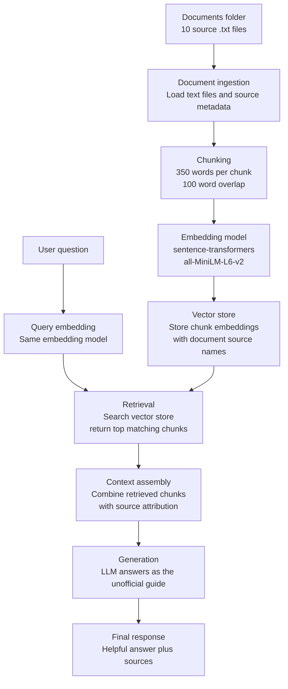

# Project 1 Planning: The Unofficial Guide

> Write this document before you write any pipeline code.
> Your spec and architecture diagram are what you'll use to direct AI tools (Claude, Copilot, etc.) to generate your implementation — the more specific they are, the more useful the generated code will be.
> Update the Retrieval Approach and Chunking Strategy sections if you change your approach during implementation.
> Update this file before starting any stretch features.

---

## Domain

<!-- What domain did you choose? Why is this knowledge valuable and hard to find through official channels? -->

--- 
subject: The Tech Student's Unofficial Guide to Building Side Projects

The reason why I choose this subject is that as a student and a coding hobbiest I want to create projects that are unique and that matter. The issue is starting off is always the hardest either because you dont know where to begin coding or unfamilar with a tool. Or you just don't have an idea. Since everyone one in the coding space has their own unique prespective  and visions idecide to use RAG to combine their prespective and create the ultimate guide using AI.

This knwoledge is valuable since their is a lot more vibecoded applciation that does not have proper security/ legal proetection aka provacy notice and ect 
## Documents

<!-- List your specific sources: URLs, subreddit names, forum threads, or file descriptions.
     Aim for at least 10 sources that together cover different subtopics or perspectives within your domain. -->

1 | rededi_cs_career_1.txt | https://www.reddit.com/r/cscareerquestions/comments/1u1iomv/really_dont_understand_the_hype_around_ai_writes/?utm_source=share&utm_medium=web3x&utm_name=web3xcss&utm_term=1&utm_content=share_button

2 |rededi_cs_career_2.txt| https://www.reddit.com/r/cscareerquestions/comments/1tvqajv/company_took_away_access_to_claude/?utm_source=share&utm_medium=web3x&utm_name=web3xcss&utm_term=1&utm_content=share_button

3 | github_readme_docs.txt | https://docs.github.com/en/repositories/managing-your-repositorys-settings-and-features/customizing-your-repository/about-readmes

4 | github_licensing_docs.txt | https://docs.github.com/en/repositories/managing-your-repositorys-settings-and-features/customizing-your-repository/licensing-a-repository

5 | twelve_factor_config.txt | https://12factor.net/config

6 | owasp_top_ten.txt | https://owasp.org/www-project-top-ten/

7 | ftc_personal_information.txt | https://www.ftc.gov/business-guidance/resources/protecting-personal-information-guide-business

8 | mdn_accessibility.txt | https://developer.mozilla.org/en-US/docs/Learn_web_development/Core/Accessibility/What_is_accessibility

9 | mdn_web_performance.txt | https://developer.mozilla.org/en-US/docs/Learn_web_development/Extensions/Performance/why_web_performance

10 | open_source_guides_starting_project.txt | https://opensource.guide/starting-a-project/

---

Each document has their own prespective and stargey on not just egtting satrted in project but industry prosepectives and ect.
## Chunking Strategy

<!-- How will you split documents into chunks?
     State your chunk size (in tokens or characters), overlap size, and explain why those
     numbers fit the structure of your documents.
     A review-heavy corpus warrants different chunking than a long FAQ. -->

**Chunk size:**

350 words
**Overlap:**
100 words
**Reasoning:**

The reasoning is some documents are shor such as the redit threads and it does not make sense to have a huge chunk that complely renders a whole thread. This word count will allow it to disget the documents in a efficent manner
---

## Retrieval Approach

<!-- Which embedding model are you using (e.g., all-MiniLM-L6-v2 via sentence-transformers)?
     How many chunks will you retrieve per query (top-k)?
     If you were deploying this for real users and cost wasn't a constraint, what tradeoffs
     would you weigh in choosing a different embedding model — context length, multilingual
     support, accuracy on domain-specific text, latency? -->

I will be using the reccomoned appouch for example purpouses.

---

## Evaluation Plan

<!-- List your 5 test questions with their expected correct answers.
     Questions should be specific enough that you can judge whether the system's response
     is right or wrong. "What are good dining halls?" is too vague.
     "What do students say about wait times at [dining hall name] during lunch?" is testable. -->

| # | Question | Expected answer |
|---|----------|-----------------|
| 1 | What Tech Stack Should I use?| The most common answer i expect to see is python, javascript and Java with some frame works. Or it Asking afollow up question.|
| 2 |Wwere should I store my code?| Github with an explation |
| 3 | What coding projects should I do? | This should list 5-10 example for each respected CS field |
| 4 | Should I use AI?| Short answer Yes. (with an explation on how to use it effictvly) |
| 5 | How should I utlize github tools to fulliest| Resposes with githubs quick start up guide|

---

## Anticipated Challenges

<!-- What could go wrong? Name at least two specific risks with reasoning.
     Consider: noisy or inconsistent documents, missing source attribution, off-topic
     retrieval, chunks that split key information across boundaries. -->

1. The questions are going to be to broad causing bounding issues with the LLM.

2.The sources offer a unique precpetive to each but does not cover the entire subject.

---

## Architecture

<!-- Draw a diagram of your pipeline showing the five stages:
     Document Ingestion → Chunking → Embedding + Vector Store → Retrieval → Generation
     Label each stage with the tool or library you're using.
     You can use ASCII art, a Mermaid diagram, or embed a sketch as an image.
     You'll use this diagram as context when prompting AI tools to implement each stage. -->

---

## AI Tool Plan

<!-- For each part of the pipeline below, describe:
     - Which AI tool you plan to use (Claude, Copilot, ChatGPT, etc.)
     - What you'll give it as input (which sections of this planning.md, which requirements)
     - What you expect it to produce
     - How you'll verify the output matches your spec

     "I'll use AI to help me code" is not a plan.
     "I'll give Claude my Chunking Strategy section and ask it to implement chunk_text()
     with my specified chunk size and overlap" is a plan. -->
I'll be utlizing AI mainly Codex to navaige certian functianility built into to chromedb and the llm functions to speed up my work flow. I'll also use to create my tests to verify certian feature are working and its giving the proper output for the edge cases.
I've used AI also to clean the documents, since it's good for patter regaoncation.
**Milestone 3 — Ingestion and chunking:**

**Milestone 4 — Embedding and retrieval:**

**Milestone 5 — Generation and interface:**
